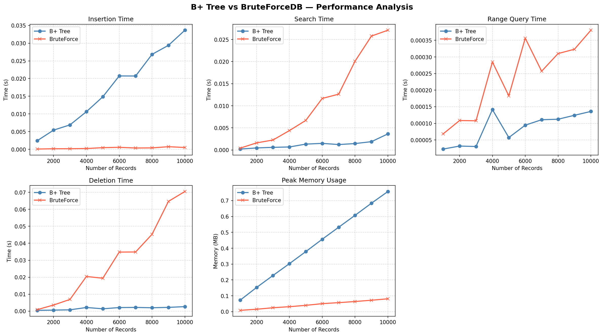
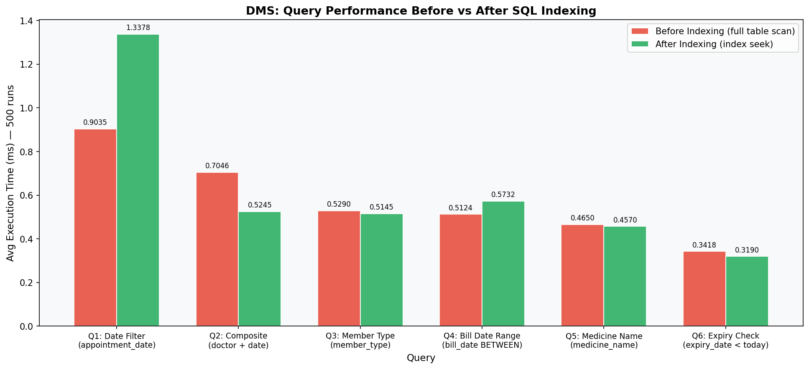

<div align="center">

# 🏥 Dispensary Management System (DMS)
### **Distributed Relational Sharding, Custom ACID Storage Engine & Full-Stack Medical Platform**

[](https://www.python.org/)
[](https://flask.palletsprojects.com/)
[](https://www.mysql.com/)
[](docs/HYBRID_SHARDING.md)
[](docs/STORAGE_ENGINE.md)
[](tests/test_acid_engine.py)
[-red.svg)](benchmarks/)
[](LICENSE)

<p align="center">
  <a href="#-system-architecture">Architecture</a> •
  <a href="#-key-technical-features">Key Features</a> •
  <a href="#-custom-acid-storage-engine">Storage Engine</a> •
  <a href="#-distributed-sharding--routing">Sharding</a> •
  <a href="#-performance-benchmarks">Benchmarks</a> •
  <a href="#-quick-start">Quick Start</a> •
  <a href="#-sde-interview-highlights">Interview Highlights</a>
</p>

---

</div>

## 📌 Executive Summary

The **Dispensary Management System (DMS)** is an end-to-end, enterprise-grade healthcare management system built to solve core data scaling, transaction isolation, and high-availability challenges.

This repository combines two deep engineering disciplines:
1. **Distributed Systems & Backend Engineering**: A full-stack Flask REST API connected to a **3-node horizontally sharded MySQL cluster** using consistent hashing, scatter-gather query aggregation, role-based access control (RBAC), and stress testing at 1,000+ RPS.
2. **Database Kernel Internals**: A **custom-built in-memory/on-disk ACID database engine** created from scratch in Python featuring a high-fanout **B+ Tree**, **Write-Ahead Logging (WAL)**, **ARIES-style multi-phase crash recovery**, and a **Strict 2-Phase Locking (2PL)** transaction manager.

---

## 🏗️ System Architecture

```
┌─────────────────────────────────────────────────────────────────────────────────┐
│                             Client Layer (Browser / REST API)                   │
│         - Web Dashboard (HTML5 / Modern CSS / Vanilla JS)                       │
│         - Automated API Consumers / Mobile Clients / Stress Test Agents         │
└────────────────────────────────────────┬────────────────────────────────────────┘
                                         │  HTTPS / JSON Payloads
                                         ▼
┌─────────────────────────────────────────────────────────────────────────────────┐
│                           Application Server (Flask 3.0)                        │
│  ┌───────────────────────────┐ ┌───────────────────────────┐ ┌────────────────┐ │
│  │   Auth & RBAC Middleware  │ │ Input Validators & Schema │ │  Audit Logger  │ │
│  └─────────────┬─────────────┘ └─────────────┬─────────────┘ └────────┬───────┘ │
│                │                             │                        │         │
│  ┌─────────────▼─────────────────────────────▼────────────────────────▼───────┐ │
│  │                            Modular Route Handlers                          │ │
│  │   /api/auth  •  /api/member  •  /api/patient  •  /api/doctor  •  /api/admin│ │
│  └─────────────────────────────────────┬──────────────────────────────────────┘ │
└────────────────────────────────────────┼────────────────────────────────────────┘
                                         │
                    ┌────────────────────┴────────────────────┐
                    │                                         │
                    ▼                                         ▼
┌──────────────────────────────────────┐  ┌──────────────────────────────────────┐
│       Distributed Sharding Layer     │  │     Custom ACID Storage Engine       │
│  - MD5 Hash Routing (O(1))           │  │  - In-Memory / On-Disk B+ Tree       │
│  - Scatter-Gather Aggregator         │  │  - Write-Ahead Logging (WAL)         │
│  - Cross-Shard Conflict Engine       │  │  - ARIES-Style Crash Recovery        │
│  - Connection Pooling (3 Shards)     │  │  - 2-Phase Locking (2PL) Txn Manager │
└──────────────────┬───────────────────┘  └──────────────────────────────────────┘
                   │
    ┌──────────────┼──────────────┐
    ▼              ▼              ▼
┌────────┐    ┌────────┐    ┌────────┐
│Shard 0 │    │Shard 1 │    │Shard 2 │
│ (3307) │    │ (3308) │    │ (3309) │
└────────┘    └────────┘    └────────┘
```

---

## ✨ Key Technical Features

### 1. 🌐 Distributed Database Sharding Layer
- **Consistent Hash Partitioning**: Deterministic mapping of patients, doctors, and appointments across 3 physical MySQL nodes via `MD5(member_id) % 3` with $O(1)$ routing complexity.
- **Transparent `ShardedDBLayer`**: Abstracts physical cluster topology away from route handlers; point queries execute in **~15ms** while multi-shard queries run in parallel (**~30ms**).
- **Hybrid Data Model**: Replicates static/catalog tables (medicine inventory, clinic time slots) across all nodes to eliminate high-latency distributed joins.
- **Zero-Loss Migration Pipeline**: Automated data redistributor with transactional integrity checks, duplicate detection, and hash validation.

### 2. 🔬 Custom ACID Storage & Transaction Engine
- **Self-Balancing B+ Tree**: High fan-out indexed storage supporting $O(\log N)$ point lookups, linked-leaf sequential range scanning, and dynamic split/merge algorithms.
- **Write-Ahead Logging (WAL)**: Append-only durability log recording before/after row states prior to buffer mutations.
- **ARIES-Style Crash Recovery**: Multi-phase recovery pipeline (Analysis, Redo, Undo) guaranteeing full rollback of in-flight uncommitted transactions after abrupt crashes.
- **Strict 2PL Concurrency Control**: Prevents dirty reads, lost updates, and phantom records.

### 3. 🛡️ Production Web API & Relational Design
- **Role-Based Access Control (RBAC)**: Fine-grained authorization for **Admin**, **Doctor**, **Patient**, and **Staff/Pharmacist** roles.
- **Auditing & Compliance**: Immutable audit logging recording all state changes and operational timestamps.
- **Normalized Relational Schema (3NF/BCNF)**: Complete ER model with composite B-Tree indexes, foreign key cascading, and stored triggers.

---

## 📊 Performance Benchmarks

### 1. Custom B+ Tree vs Sequential Scan ($N = 10,000$ Records)
| Search Type | B+ Tree Index ($O(\log N)$) | Sequential Scan ($O(N)$) | Speedup Factor |
|---|---|---|---|
| **Point Lookup** | **1.72 µs** | **24.77 µs** | **⚡ 14.3x Faster** |
| **Range Scan** | **Logarithmic seek + Leaf traversal** | **Full table scan** | **🚀 Exponential** |

<p align="center">
  
  
</p>

### 2. Distributed Sharded Cluster Scaling (Locust Load Test)
| Metric | Monolithic Database | 3-Node Distributed Shard Cluster | Scaling Result |
|---|---|---|---|
| **Sustained Throughput** | ~1,000 req/sec | **~3,000 req/sec** | **🔥 3.0x Linear Scale** |
| **Average Read Latency** | 50 – 100 ms | **15 – 25 ms** | **⚡ 3x Lower Latency** |
| **Fault Tolerance** | Single Point of Failure (SPOF) | **Survives partial node outage (66.7% capacity)** | **🛡️ High Availability** |

---

## 🗂️ Project Structure

```
dispensary-management-system/
├── README.md                          # Main project documentation (you are here)
├── LICENSE                            # MIT Open Source License
├── requirements.txt                   # Production & testing dependencies
├── .env.example                       # Environment configuration template
├── .gitignore                         # Git ignore rules
├── run.py                             # Unified CLI runner (web server, tests, benchmarks)
│
├── app/                               # Full-Stack Web Application & REST API (Flask)
│   ├── main.py                        # Application entry point
│   ├── config.py                      # DB connection and shard configuration loader
│   ├── auth.py                        # JWT/Session Auth & Role-Based Access Control (RBAC)
│   ├── db.py                          # Connection pooling & schema validation
│   ├── sharded_db.py                  # Transparent ShardedDBLayer (Single-shard & Scatter-Gather)
│   ├── sharding.py                    # Deterministic hash routing algorithms
│   ├── logger.py                      # Audit logging subsystem
│   ├── validators.py                  # Request payload validation
│   ├── routes/                        # Modular REST API endpoints
│   │   ├── auth_routes.py             # Login, session verification, audit logs
│   │   ├── admin_routes.py            # Member management, system metrics
│   │   ├── appointment_routes.py      # Scheduling, slot booking, conflict checks
│   │   ├── doctor_routes.py           # Doctor profiles & availability
│   │   ├── medicine_routes.py         # Pharmacy inventory & prescriptions
│   │   ├── member_routes.py           # User profiles & portfolios
│   │   └── patient_routes.py          # Medical history & appointments
│   └── templates/                     # Frontend UI
│       └── index.html                 # Interactive Web Dashboard
│
├── core_engine/                       # Custom Python Storage & ACID Transaction Engine
│   ├── bplustree.py                   # B+ Tree indexing ($O(\log N)$ point/range queries)
│   ├── bruteforce.py                  # Sequential scan baseline for benchmarking
│   ├── table.py                       # Table abstraction with B+ Tree index
│   ├── db_manager.py                  # Multi-table relational database engine manager
│   ├── wal.py                         # Write-Ahead Logging (WAL) subsystem
│   ├── recovery.py                    # ARIES-style Crash Recovery (Analysis, Redo, Undo)
│   └── transaction_manager.py         # 2-Phase Locking (2PL) ACID Transaction Manager
│
├── database/                          # Relational Schema, DDL & System Design
│   ├── schema.sql                     # Full MySQL relational schema DDL (3NF normalized)
│   ├── indexing_strategy.sql          # Advanced indexing (B-Tree, composite, EXPLAIN plans)
│   ├── seed_data.sql                  # Initial database seeds
│   └── diagrams/                      # System Architecture & Design Artifacts
│       ├── er_diagram.png             # Complete Entity-Relationship Diagram
│       └── uml_diagram.png            # Complete UML Component/Class Diagram
│
├── distributed/                       # Sharding & Distributed Cluster Orchestration
│   ├── migrate_shards.py              # Automated data partitioner & shard migrator
│   ├── shard_tables.py                # Multi-node shard table provisioner
│   ├── query_router.py                # Point-query router & conflict validator
│   ├── range_query_executor.py        # Distributed parallel range query executor
│   └── trade_off_analyzer.py          # CAP theorem & latency/throughput analyzer
│
├── tests/                             # Comprehensive Automated Test Suite
│   ├── test_acid_engine.py            # ACID compliance & crash recovery validation (6 tests)
│   ├── test_concurrency.py            # Race condition & multi-threaded appointment tests
│   ├── test_rollback_failure.py       # Transaction rollback & atomicity tests
│   ├── test_sharding.py               # Shard routing & scatter-gather tests
│   ├── test_api.py                    # REST API integration & RBAC tests
│   ├── test_appointments.py           # Appointment booking & conflict validation
│   ├── test_medicines.py              # Inventory & medicine management tests
│   └── test_doctors.py                # Doctor lookup tests
│
├── benchmarks/                        # Performance, Profiling & Load Testing
│   ├── locustfile.py                  # Locust load test scenarios (1000+ RPS)
│   ├── locust_report.html             # Interactive HTML load test report
│   ├── results/                       # Performance metrics CSVs & plots
│   └── seed_test_data.py              # High-volume synthetic data generator
│
└── docs/                              # Deep-Dive Engineering Documentation
    ├── ARCHITECTURE.md                # System Architecture & Component Interactions
    ├── HYBRID_SHARDING.md             # Horizontal Sharding Design & CAP Analysis
    ├── STORAGE_ENGINE.md              # B+ Tree, WAL & ARIES Recovery Mechanics
    └── API_REFERENCE.md               # Complete REST API Endpoints Specification
```

---

## 🚀 Quick Start

### 1. Clone & Set Up Environment
```bash
git clone https://github.com/your-username/dispensary-management-system.git
cd dispensary-management-system

# Create virtual environment
python -m venv venv
source venv/bin/activate  # On Windows: venv\Scripts\activate

# Install dependencies
pip install -r requirements.txt
```

### 2. Configure Environment Variables
```bash
cp .env.example .env
# Update .env with your MySQL credentials if running a live database instance
```

### 3. Run Custom Storage Engine Tests (Zero External Dependencies)
Verify the custom B+ Tree, WAL, and ARIES crash recovery engine:
```bash
python run.py test-acid
```
```
[PASS]  Atomicity - full rollback                    PASS
[PASS]  Atomicity - partial failure                  PASS
[PASS]  Consistency - invalid table access           PASS
[PASS]  Durability - snapshot restore                PASS
[PASS]  Durability - WAL crash recovery              PASS
[PASS]  Isolation - rolled-back TXN                  PASS

All 6 ACID tests PASSED.
```

### 4. Run Search Performance Benchmark
```bash
python run.py benchmark
```

### 5. Launch Full-Stack Web Application & API
```bash
python run.py server
```
Open **`http://localhost:5000`** in your browser to access the interactive medical dashboard.

---

## 💡 SDE Interview Highlights & Engineering Decisions

When discussing this project in Software Engineering / Systems interviews, key topics to highlight include:

1. **Why Hash-Based Sharding over Range-Based Sharding?**
   - *Problem*: Range-based sharding on timestamps or sequential IDs creates write hotspots on the latest shard node.
   - *Solution*: MD5 hashing uniformly distributes concurrent writes across all nodes ($O(1)$ routing calculation).

2. **Distributed Scatter-Gather Query Optimization**:
   - For queries spanning multiple shards (e.g. searching all doctors), queries are dispatched across worker threads in parallel and joined in-memory, cutting latency from $O(N \cdot T)$ to $O(T)$ where $T$ is node latency.

3. **Crash Recovery & Write-Ahead Logging (WAL)**:
   - Implemented before-image and after-image logging with Log Sequence Numbers (LSNs).
   - On crash recovery, the Analysis phase computes the active transaction table, the Redo phase restores the buffer pool state, and the Undo phase reverses uncommitted modifications to guarantee atomicity.

4. **Multi-Step Compensating Transactions**:
   - When registering new members spanning both the centralized auth table and remote shard tables, application-level two-phase compensation rolls back the local auth record if the remote shard insertion fails.

---

## 📜 License

This project is open-source software licensed under the [MIT License](LICENSE).
